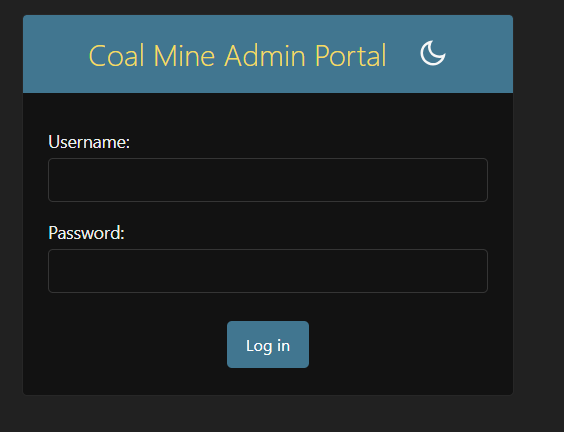
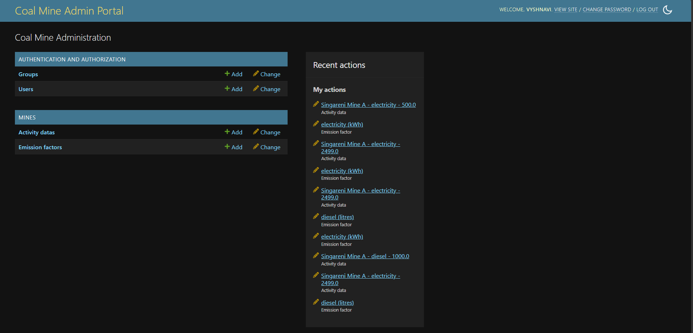
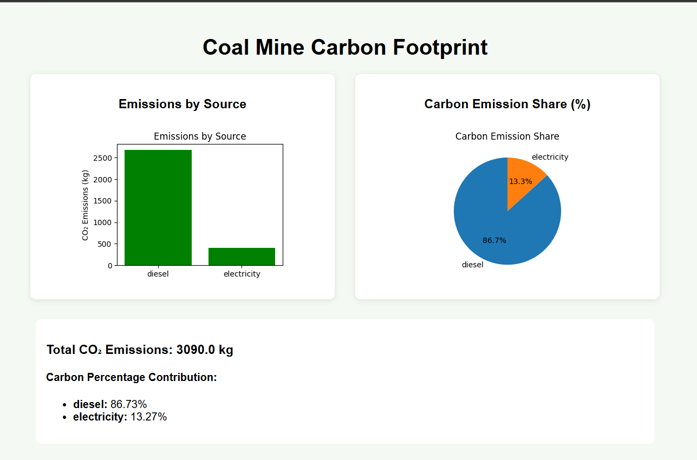

# Coal Carbon Footprint Dashboard

A Django-based web application developed to monitor, calculate, and visualize carbon dioxide (CO₂) emissions generated from coal mining operations.

The system enables tracking of emissions from activities such as:
- Diesel consumption
- Electricity usage
- Explosives
- Transportation

The application automatically calculates CO₂ emissions using predefined emission factors and presents the results through graphical visualizations and analytical dashboards.

---

## Features

- Mining activity data management
- Automated CO₂ emission calculation
- Interactive dashboard with charts and analytics
- Emission source tracking and comparison
- Admin panel for data management
- Responsive and user-friendly interface

---

## Technology Stack

- Python
- Django
- SQLite
- Matplotlib
- HTML/CSS

---

## Installation & Setup

### 1. Activate virtual environment

```bash
venv\Scripts\activate
```

### 2. Install dependencies

```bash
pip install -r requirements.txt
```

### 3. Apply database migrations

```bash
python manage.py migrate
```

### 4. Run the development server

```bash
python manage.py runserver
```

### 5. Open in browser

```text
http://127.0.0.1:8000/dashboard/
```

---

## Dashboard Preview

### Login Page



### Admin Panel



### Dashboard



## Project Structure

```text
coal_carbon_app/
│
├── coal_carbon/
├── mines/
├── templates/
├── images/
├── db.sqlite3
├── manage.py
├── requirements.txt
└── README.md
```

---

## Purpose of the Project

The primary objective of this project is to support environmental sustainability in mining operations by providing a platform for monitoring carbon emissions, analyzing environmental impact, and generating visual analytical reports.

---

